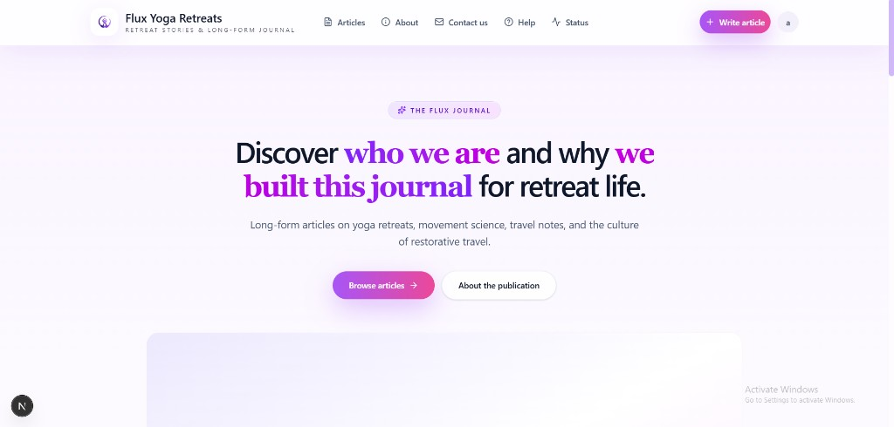
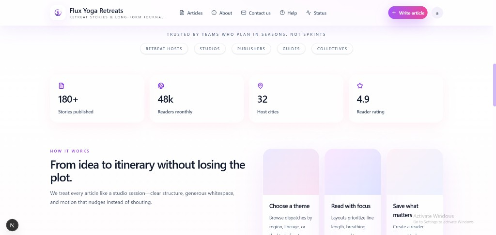
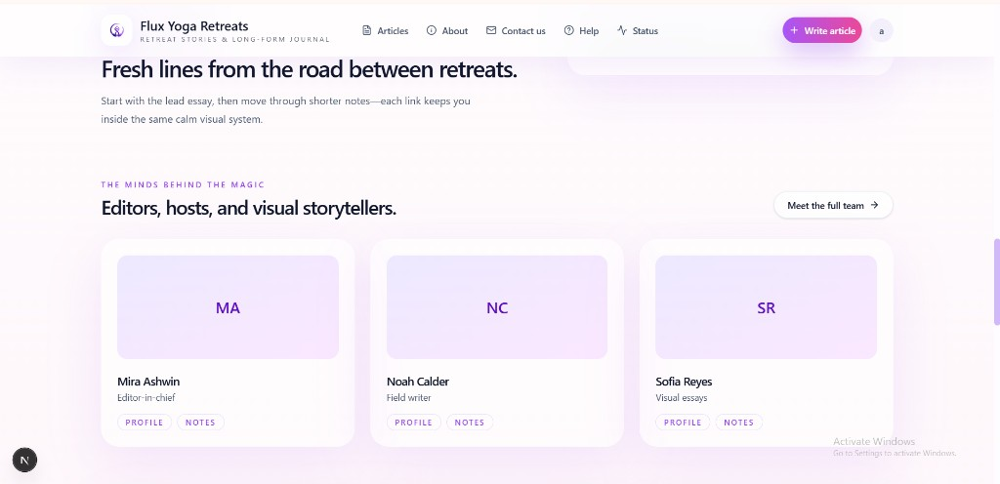
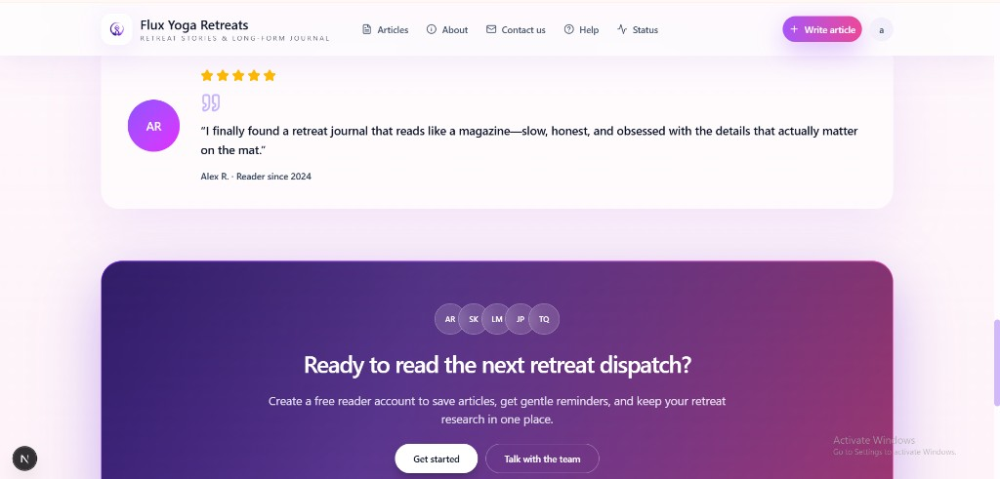
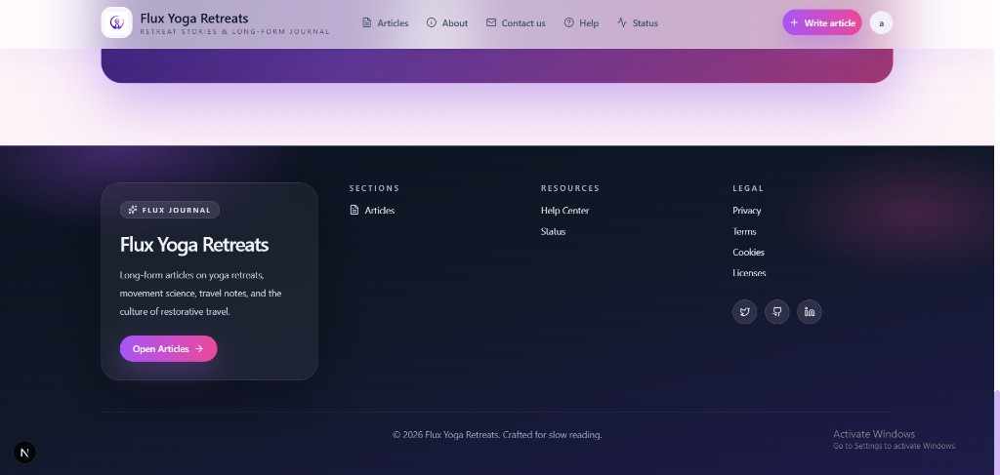
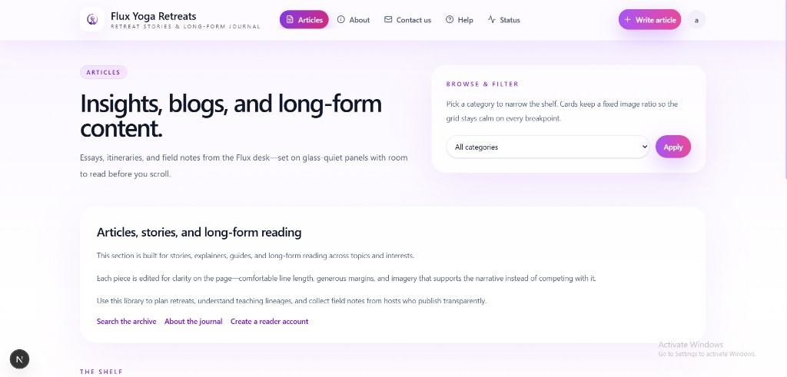
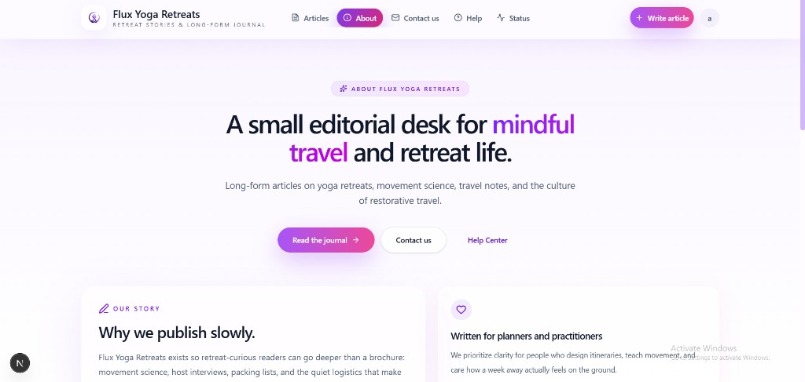
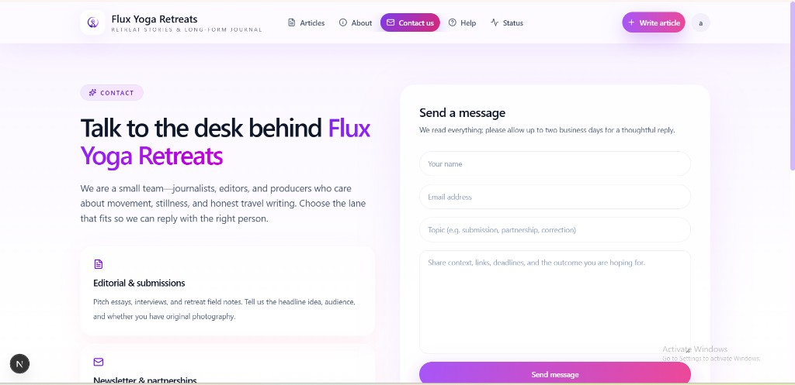
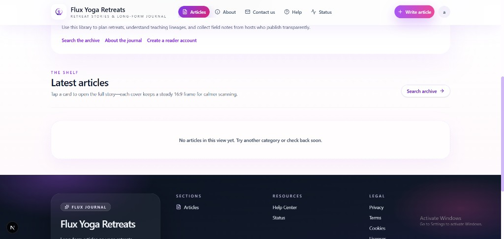

# Flux Yoga Retreats

Long-form editorial site for retreat stories, movement notes, and restorative travel—built with Next.js.

## UI screenshots

Images below are stored in [`docs/readme-screenshots/`](docs/readme-screenshots/) so they render on GitHub from this repository.

### Home — hero

### Home — trust strip and metrics

### Home — team highlights

### Home — testimonial and reader CTA

### Footer — editorial layout

### Articles — browse and intro

### Articles — latest shelf

### About

### Contact

---

*Screenshots reflect the in-repo UI at the time they were captured.*
